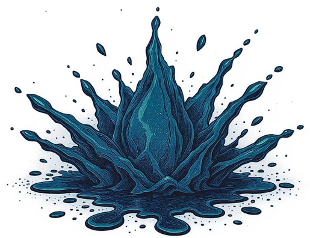
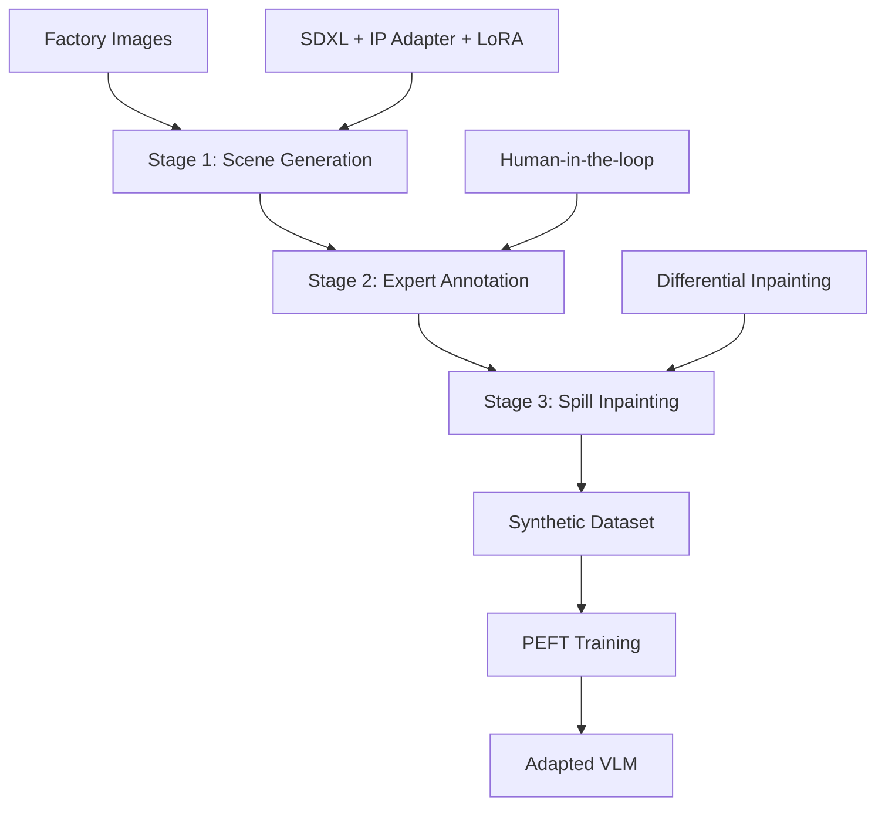

# SynSpill: Improved Industrial Spill Detection With Synthetic Data

<div align="center">

  [](https://iccv2025.thecvf.com/)
  [](https://eternal-f1ame.github.io/SynSpill/)
  [](./latex/main.pdf)
</div>

<div align="center">

  [](https://www.ucf.edu/)
  [](https://www.siemens-energy.com/)

  
  
  **Beyond Zero-Shot: Industrial Spill Detection via Synthetic Data and PEFT**
  
  *Aaditya Baranwal¹, Abdul Mueez¹, Jason Voelker², Guneet Bhatia², Shruti Vyas¹*

</div>

---

## Abstract

Large-scale Vision-Language Models (VLMs) have transformed general-purpose visual recognition through strong zero-shot capabilities. However, their performance degrades significantly in niche, safety-critical domains such as industrial spill detection, where hazardous events are rare, sensitive, and difficult to annotate.

We address this challenge by introducing a scalable framework centered on a high-quality synthetic data generation pipeline that enables effective Parameter-Efficient Fine-Tuning (PEFT) of VLMs and substantially boosts the performance of state-of-the-art object detectors such as YOLO and DETR.

## Key Highlights

- **Industrial Safety Focus**: Framework for automated industrial spill detection in safety-critical domains
- **Synthetic Data Pipeline**: Triple-guided generative process using Stable Diffusion XL with IP adapters and LoRA
- **VLM Adaptation**: Parameter-efficient fine-tuning with LoRA for vision-language models  
- **Dual Approach**: Benefits both Vision-Language Models and object detectors (YOLO, DETR)
- **Zero-Shot Capability**: VLMs generalize better to unseen spill scenarios than traditional detectors
- **Real-World Validation**: Evaluated on both public and proprietary industrial datasets

## Architecture Overview



## Results

**Dataset Composition:**

- Synthetic images: 2,000 (Generated via Our Pipeline)
- Public dataset: 1,520 images (Deduplicated Roboflow Images)
- Proprietary dataset: 150 images  (Seimens Energy)

**Performance (mAP@50):**

| Method | Public Dataset | Proprietary Dataset |
|--------|----------------|-------------------|
| Qwen-VL 7B (Zero-Shot) | 0.35 | 0.15 |
| Qwen-VL 32B (Zero-Shot) | 0.42 | 0.24 |
| **Baselines (Fine-Tuning w/ Synthetic + Public Data)** |  |  |
| YOLOv11 | 0.81 | 0.64 |
| RF-DETR | 0.83 | 0.67 |
| **Proposed Method (PEFT w/ Synthetic + Public Data)** |  |  |
| Qwen-VL 7B + LoRA (V+L) | 0.78 | 0.66 |
| **Qwen-VL 32B + LoRA (V+L)** | **0.84** | **0.71** |

**Key Findings:**

- PEFT-adapted VLMs match or exceed detector performance
- Our proposed method achieves state-of-the-art results on both datasets
- Qwen-VL 32B + LoRA (V+L) outperforms all baselines including fine-tuned detectors
- Synthetic data enables effective domain adaptation for vision-language models

## Citation

```bibtex
@inproceedings{baranwal2025synspill,
    title={SynSpill: Improved Industrial Spill Detection With Synthetic Data},
    author={Baranwal, Aaditya and Bhatia, Guneet and Mueez, Abdul and Voelker, Jason and Vyas, Shruti},
    booktitle={Proceedings of the IEEE/CVF International Conference on Computer Vision},
    year={2025}
}
```

## License

This project is licensed under the MIT License - see the [LICENSE](LICENSE) file for details.

## Acknowledgments

- **University of Central Florida** - Research Support and Academic Guidance
- **Siemens Energy** - Industrial Partnership

---
